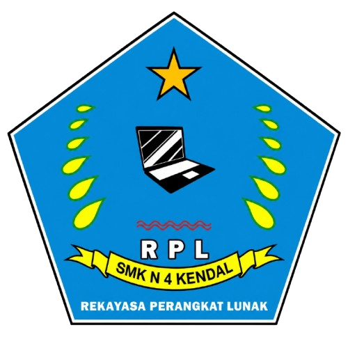
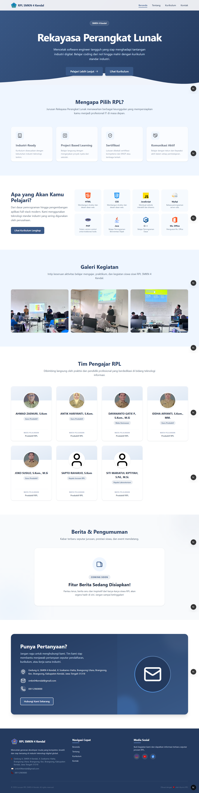
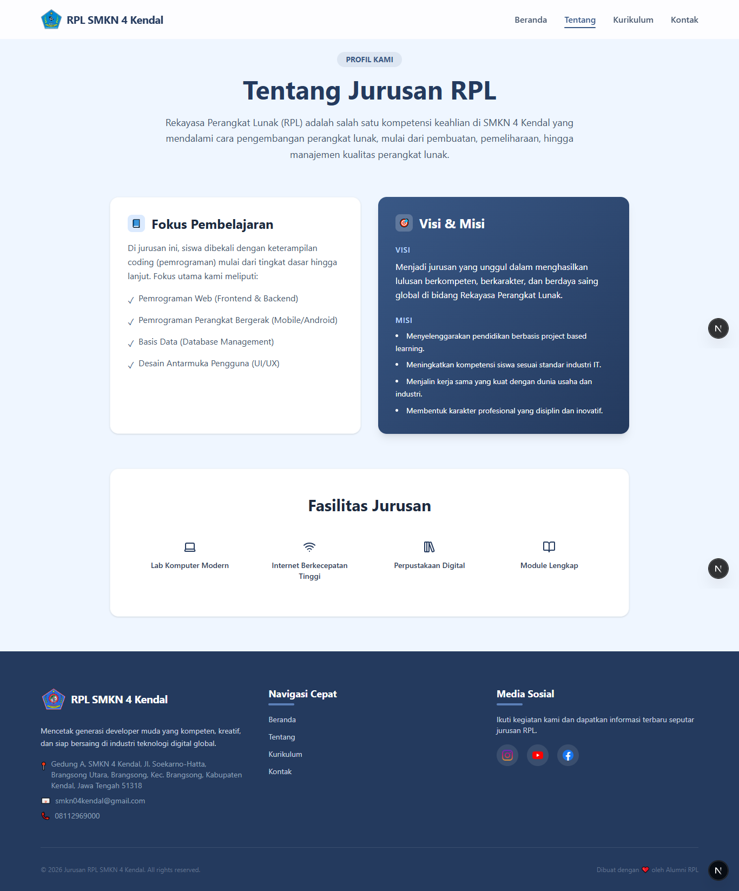
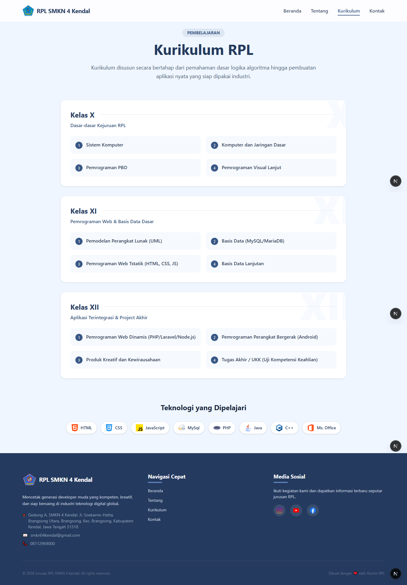
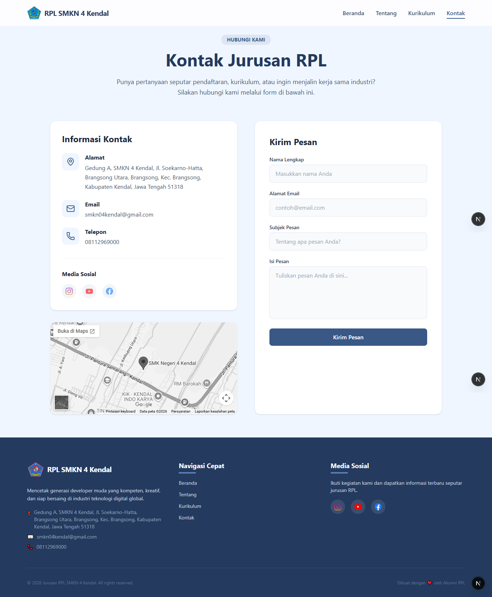
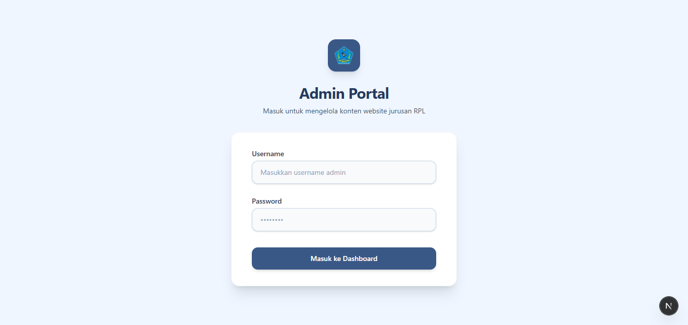
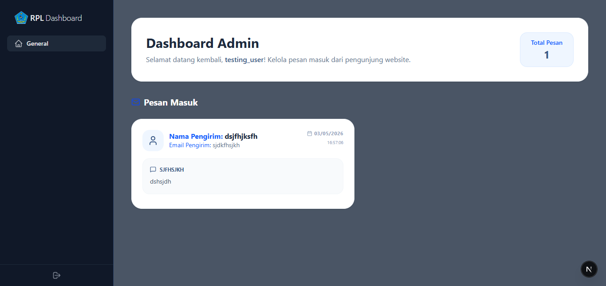

# RPL Profile - SMKN 4 Kendal

<div align="center">
  
  <p align="center">
    <strong>Website resmi profil jurusan Rekayasa Perangkat Lunak (RPL) SMKN 4 Kendal.</strong>
  </p>
</div>

<div align="center">
  
  
  
  
  
</div>

---

## Daftar Isi

1. [Tentang Project](#tentang-project)
2. [Fitur](#fitur)
3. [Tech Stack](#tech-stack)
4. [Prasyarat](#prasyarat)
5. [Instalasi & Setup](#instalasi--setup)
6. [Cara Penggunaan](#cara-penggunaan)
7. [Struktur Folder](#struktur-folder)
8. [Dokumentasi API & Komponen](#dokumentasi-api--komponen)
9. [Environment Variables](#environment-variables)
10. [Panduan Kontribusi](#panduan-kontribusi)
11. [FAQ](#faq)
12. [Roadmap](#roadmap)
13. [Lisensi](#lisensi)
14. [Kontak & Acknowledgements](#kontak--acknowledgements)

---

## Tentang Project

**RPL Profile** adalah platform informasi digital yang dirancang khusus untuk memperkenalkan Program Keahlian Rekayasa Perangkat Lunak di SMKN 4 Kendal kepada calon siswa, industri, dan masyarakat luas.

Project ini hadir untuk memecahkan masalah aksesibilitas informasi jurusan yang sebelumnya tersebar di berbagai platform. Dengan website ini, seluruh data mulai dari daftar guru, kurikulum, hingga prestasi siswa tersentralisasi dalam satu antarmuka yang modern dan responsif.

---

## Fitur

Website ini dilengkapi dengan berbagai fitur unggulan:

- **Landing Page Informatif**: Tampilan beranda yang profesional dengan ringkasan keunggulan jurusan.
- **Profil Guru**: Daftar tenaga pendidik lengkap dengan jabatan dan mata pelajaran yang diampu.
- **Eksplorasi Kurikulum**: Informasi detail mengenai mata pelajaran yang dipelajari di tiap tingkat kelas.
- **Galeri Kegiatan**: Dokumentasi visual kegiatan praktik, kunjungan industri, dan perlombaan.
- **Contact Form (Pesan)**: Fitur pengiriman pesan langsung ke admin yang terintegrasi dengan database.
- **Admin Dashboard**: Area privat untuk mengelola data pesan masuk dengan sistem autentikasi JWT.
- **Mode Responsif**: Tampilan yang optimal di perangkat mobile, tablet, maupun desktop.

---

## Tech Stack

Teknologi yang dipilih untuk membangun project ini meliputi:

| Teknologi                   | Alasan Pemilihan                                                                    |
| :-------------------------- | :---------------------------------------------------------------------------------- |
| **Next.js 15 (App Router)** | Framework React terbaik untuk SEO, performa tinggi, dan routing yang fleksibel.     |
| **TypeScript**              | Memberikan keamanan tipe (_type-safety_) untuk meminimalisir bug saat pengembangan. |
| **Tailwind CSS**            | Mempercepat proses styling dengan pendekatan utility-first yang modern.             |
| **MySQL & MySql2**          | Database relasional yang handal untuk penyimpanan data pesan secara permanen.       |
| **Framer Motion**           | Library standar untuk animasi UI yang halus dan interaktif.                         |
| **Lucide React**            | Koleksi ikon yang ringan, konsisten, dan mudah digunakan.                           |
| **Jose**                    | Library ringan untuk enkripsi dan verifikasi JWT di lingkungan Edge Runtime.        |

---

## Prasyarat

Sebelum memulai, pastikan Anda telah menginstal software berikut:

- [Node.js](https://nodejs.org/) (Versi 18.x atau terbaru)
- [MySQL Server](https://www.mysql.com/)
- [Git](https://git-scm.com/)
- Code Editor (Direkomendasikan VS Code)

---

## Instalasi & Setup

Ikuti langkah-langkah berikut untuk menjalankan project di lokal:

### 1. Clone Repository

```bash
git clone https://github.com/NaApipp/profile_rpl.git
cd profile_rpl
```

### 2. Install Dependencies

```bash
npm install
```

### 3. Konfigurasi Database

Buat database baru di MySQL Anda, lalu impor tabel `tb_pesan`:

``` sql
CREATE DATABASE db_rpl;
USE db_rpl;
```


```sql
CREATE TABLE tb_pesan (
  id_pesan INT AUTO_INCREMENT PRIMARY KEY,
  nama_lengkap VARCHAR(255) NOT NULL,
  email VARCHAR(255) NOT NULL,
  subjek_pesan VARCHAR(255) NOT NULL,
  pesan TEXT NOT NULL,
  created_at VARCHAR(50) NOT NULL
);
```

### 4. Setup Environment

Buat file `.env` di root directory dan sesuaikan konfigurasinya (lihat bagian [Environment Variables](#environment-variables)).

### 5. Jalankan Server Development

```bash
npm run dev
```

Buka [http://localhost:3000](http://localhost:3000) di browser Anda.

---

## Cara Penggunaan

### Mengirim Pesan (Siswa/Tamu)

1. Buka halaman **Kontak**.
2. Isi form Nama, Email, Subjek, dan Pesan.
3. Klik tombol **Kirim Pesan**. Status pengiriman akan muncul secara interaktif.

### Login Admin (Pengelola)

1. Akses halaman `/login-admin`.'

2.Masukkan username dan password default (lihat file `lib/user.ts`).

3. Anda akan diarahkan ke Dashboard untuk melihat daftar pesan masuk.

---

## Struktur Folder

```text
profile_rpl/
├── app/                  # Next.js App Router (Halaman & API)
│   ├── (landing)/        # Route Group: Halaman publik (Navbar & Footer global)
│   ├── (dashboard)/      # Route Group: Halaman privat admin (Sidebar & Guard)
│   ├── api/              # API Route Handlers (Auth & Pesan)
│   └── layout.tsx        # Root layout (Base shell)
├── components/           # Komponen UI Reusable
│   ├── layout/           # Navbar & Footer landing
│   ├── sections/         # Section per halaman (Hero, Galeri, dll)
│   └── ui/               # Komponen atom (Button, dll)
├── data/                 # Dummy data statis (Guru, Berita, dll)
├── lib/                  # Utilitas backend (DB Config, Auth logic)
├── public/               # Asset statis (Logo, Icon, Gambar)
└── .env                  # Variabel rahasia (Database & Secret)
```

---

## Dokumentasi API & Komponen

### Endpoint Utama

| Method | Endpoint          | Fungsi                                     |
| :----- | :---------------- | :----------------------------------------- |
| `POST` | `/api/pesan`      | Menyimpan pesan baru dari form kontak.     |
| `GET`  | `/api/pesan`      | Mengambil semua pesan (Hanya untuk Admin). |
| `POST` | `/api/auth/login` | Autentikasi admin dan pemberian token JWT. |

### Komponen Button

Digunakan secara konsisten di seluruh aplikasi.

```tsx
<Button
  href="/tujuan" // Jika diisi, merender Link (Next.js)
  variant="primary" // Pilihan: primary | outline
  className="..." // Tambahan class Tailwind
>
  Teks Tombol
</Button>
```

---

## Environment Variables

Aplikasi ini membutuhkan variabel berikut di file `.env`:

| Variabel               | Deskripsi      | Contoh Nilai               |
| :--------------------- | :------------- | :------------------------- |
| `DATABASE_HOST`        | Host MySQL     | `localhost`                |
| `DATABASE_USERNAME`    | Username DB    | `root`                     |
| `DATABASE_PASSWORD`    | Password DB    | `password123`              |
| `DATABASE_NAME`        | Nama Database  | `db_rpl`               |
| `DATABASE_PORT_NUMBER` | Port MySQL     | `3306`                     |
| `AUTH_SECRET`          | Secret Key JWT | `minimal_32_karakter_acak` |

---

## Panduan Kontribusi

Kontribusi selalu terbuka! Ikuti langkah ini:

1. **Fork** project ini.
2. Buat **Branch** baru (`git checkout -b feature/FiturKeren`).
3. **Commit** perubahan Anda dengan format [Conventional Commits](https://www.conventionalcommits.org/) (contoh: `feat: menambah fitur galeri`).
4. **Push** ke branch Anda (`git push origin feature/FiturKeren`).
5. Buat **Pull Request**.

---

## FAQ

**Q: Apakah data guru bisa diubah?**
A: Bisa, cukup edit file `data/guruData.ts` untuk perubahan data statis.

--------------------------------------------------------

**Q: Mengapa saya tidak bisa login admin?**

A: Pastikan variabel `AUTH_SECRET` di `.env` sudah diisi dan kredensial cocok dengan `lib/user.ts`.

--------------------------------------------------------

**Q: Bagaimana cara mengganti logo?**

A: Ganti file `public/asset/image/logo/logo-rpl.png` dengan logo baru Anda (disarankan format .png transparan).

--------------------------------------------------------

**Q: Apakah website ini sudah SEO friendly?**

A: Ya, sudah dioptimasi menggunakan Metadata API dari Next.js di `app/layout.tsx`.

--------------------------------------------------------

**Q: Bagaimana cara menghapus pesan di dashboard?**

A: Fitur hapus sedang direncanakan di Roadmap versi selanjutnya.

--------------------------------------------------------

**Q: Bagaimana cara login admin?**

A: Login admin ada di `/login-admin` dan gunakan username serta password yang ada di file `lib/user.ts`.

--------------------------------------------------------

**Q: Apa yang dilakukan jika `npm install` gagal?**

A: Ada beberapa penyebab umum, coba langkah berikut secara berurutan:

1. **Periksa versi Node.js** — Pastikan versi Node.js Anda >= 18.x
```bash
   node -v
```

2. **Hapus cache npm** — Cache yang korup bisa menyebabkan instalasi gagal
```bash
   npm cache clean --force
```

3. **Hapus folder `node_modules` dan `package-lock.json`**, lalu install ulang
```bash
   rm -rf node_modules package-lock.json
   npm install
```

4. **Cek koneksi internet** — Beberapa package diunduh dari registry npm,
   pastikan koneksi stabil.

5. Jika masih gagal, buka **Issues** di repository ini dan sertakan
   pesan error yang muncul di terminal.

--------------------------------------------------------

**Q: Bagaimana cara deploy ke VPS atau server sendiri?**

A: Ikuti langkah berikut di server kamu:

1. **Clone repository** ke server
```bash
   git clone https://github.com/NaApipp/profile_rpl.git
   cd profile_rpl
```

2. **Install dependencies**
```bash
   npm install
```

3. **Buat file `.env`** dan isi dengan konfigurasi database server

4. **Build project**
```bash
   npm run build
```

5. **Jalankan dengan PM2** agar server tetap hidup di background
```bash
   npm install -g pm2
   pm2 start npm --name "profile-rpl" -- start
   pm2 save
```

6. Akses aplikasi di `http://IP-SERVER:3000`

> 💡 Untuk domain dan HTTPS, gunakan **Nginx** sebagai reverse proxy
> dan **Certbot** untuk SSL gratis.
---

## Display UI UX

### Main Page

<div align="center">
  <br/>
  <p align="center"><strong>Home Page</strong></p>
  
  <br/><br/>
  
  <p align="center"><strong>Tentang Page</strong></p>
  
  <br/><br/>

  <p align="center"><strong>Kurikulum Page</strong></p>
  
  <br/><br/>

  <p align="center"><strong>Kontak Page</strong></p>
  
  <br/><br/>
</div>

### Dashboard Page

<div align="center">
  <br/>
  <p align="center"><strong>Login Portal</strong></p>
  
  <br/><br/>

  <p align="center"><strong>Dashboard Admin</strong></p>
  
  <br/><br/>
</div>


---

## Roadmap

- [x] Landing Page & Profil Jurusan.
- [x] Integrasi MySQL untuk form kontak.
- [x] Dashboard Admin dengan JWT.
- [x] Halaman Not Found kustom.
- [ ] Sistem CMS untuk manajemen konten berita.
- [ ] Fitur unduh rekap pesan ke format Excel/PDF.
- [ ] Dark Mode Support.

---

## Lisensi

Didistribusikan di bawah **MIT License**. Lihat `LICENSE` untuk informasi lebih lanjut.

---

## Kontak & Acknowledgements

**Nabil Arif Triyanto (Apip)** - [@n_apipppp](https://instagram.com/n_apipppp) - nabilariftriyanto@gmail.com

Project Link: [https://github.com/NaApipp/profile_rpl](https://github.com/NaApipp/profile_rpl)

**Terima kasih kepada:**

- [Next.js Team](https://nextjs.org/) atas framework yang luar biasa.
- [Lucide Icons](https://lucide.dev/) untuk library ikonnya.

---

<p align="center">Made by Alumni RPL</p>
